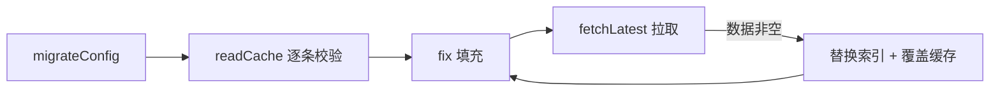

# dsh-model-fix

## 项目简介

DSH 插件：为所有非官方（自定义）提供方的模型自动填充推理级别（`reasoningEfforts`）、最大上下文（`contextWindow`）、输出上限（`maxTokens`）与图片模态（`input`），数据来自 models.dev；并按兼容性规则为 openai-completions 提供方维护路由级 `compat`（当前一条：不使用 `developer` 角色）。另按提供方维度提供排除（`excludes`：命中的提供方本插件零操作）。

## 技术栈与目录

Node.js（ESM）+ `@deepseek-ai/cordis` 插件；tsdown（rolldown）双配置构建到 `lib/`（Node 半 `index.js` + 浏览器半 `client.js`，clean 只由 Node 半配置承担）；TypeScript 严格模式。产物不带 sourcemap。

| 路径 | 职责（只标非显而易见的部分） |
| --- | --- |
| `src/index.ts` | 仅 `export` + `apply` 生命周期编排，业务全部外拆 |
| `src/types.ts` | 共享类型与守卫；**历史版本(v1/v2/v3) 是冻结形态**；Connection RPC 契约的结构本地复制也在这里 |
| `src/constants.ts` | 命名空间、版本与保留上限、重试参数、`CAPACITY_UNLIMITED`、提供商提示表 `HINTS`、兼容性落点 `DEVELOPER_COMPAT_APIS` / `DEVELOPER_COMPAT_FIELD` |
| `src/config.ts` / `src/migrate.ts` | 当前 schema 与 `resolveConfig` / 升级链与 `migrateConfig` 编排 |
| `src/catalog.ts` / `src/lookup.ts` | 缓存与拉取、拍平与条目校验 / id 归一化匹配与档位转换 |
| `src/fix.ts` | 填充与写回（`force` 供强制更新单次绕过）；模型参数与路由 compat 两类 op 同批提交；`excludes` 命中的提供方在 provider 循环入口即整条跳过（两类 op 与 force 一起被排除，故不在各分支重复判断） |
| `src/compat.ts` | 兼容性规则 → provider 路由 `compat` 的纯写入计划（添加 / 移除 / 删空整段 unset），零 ctx 依赖故可单测 |
| `src/rpc.ts` / `src/refresh.ts` | 强制更新 channel / 刷新编排（含重试） |
| `src/client/` | 浏览器半：`index.tsx` 入口（词典/两个 scope/RPC 载体/槽注册）、`card.tsx` 卡片（三张布尔瓦片 + 一张排除集合瓦片）、`model.ts` 快照↔配置（三组布尔 + `excludes`）与命中判定的纯映射（唯一可单测的浏览器半模块）、`locales.ts` 中英词典 |
| `public/models-cache.json` | 构建期随 `lib/public/` 发布的 models.dev 拍平缓存（首启离线可用） |
| `cordis.patch.yml` | DSH 补丁层对本插件的注册 |

## 硬约束（违反即坏）

### 跨半与宿主契约

- **浏览器半禁止值导入 Node 半模块**（`src/constants.ts` 会拖入 `node:path`）。因此配置命名空间、提供商 NS（`PI_AI_NS`）、`CONFIG_VERSION`、RPC channel 名在 `src/client/model.ts` 以**字面量**另存一份，与 `src/constants.ts` / `src/rpc.ts` **改动必须两侧同步**（`test/client-model.test.ts` 有漂移守护用例）；`tsdown.config.ts` 的 purity 门禁会拦住越界值导入（type-only 被擦除，不受限）。同理，provider id 的合法性正则 `EXCLUDE_ID_PATTERN` 是宿主 models 页 `ROUTE_PATTERN` 的字面复制，升宿主须复核。
- 浏览器半 externals 只允许宿主模块表基线那几项，其余一律打进包；基线权威列表在宿主 `packages/client/web/src/platform.ts`，漂移的后果是运行期 `require` 未命中。
- `package.json` 的 `dsh.client.inject` 是**依赖包图边**（填槽位所有者包），不是 cordis 服务名；服务名只写在 `src/client/index.tsx` 的 `export const inject`。
- 浏览器半产物必须复刻宿主 client 的闭包工厂契约（`window.__ModuleLoader__.load` + banner/intro/footer 三段）。声明了 `dsh.client` 后，缺 `lib/client.js` 会让宿主**激活期聚合抛错** ⇒ **build 必须先于 link/安装到宿主**。
- 卡片挂在宿主 `ModelsSection` 为仓库外插件预留的 list 席位 `settings.models.footer`（「模型」选项卡页面底部）；**选项卡头部在任何宿主版本都没有席位**，别往那儿挂。
- client 模块必须 `export const name`，且与包名一致。
- **对外纪律：前端可用面一律以 npm 发布版为准**（`npm view @deepseek-ai/dsh dist-tags`）；宿主源码仓 HEAD 领先一切已发布版本，只作参照，**其工作树路径不得写进本项目文档**（未被版本追踪）。本插件的宿主依赖**总是跟随宿主 latest**：`@deepseek-ai/dsh-*`（`dsh-settings` 与 6 个 `dsh-client-*`）取宿主 latest 的那个版本号（当前 `0.1.2-rc.1`），`peerDependencies` 同版作下限；`@deepseek-ai/cordis` / `schemastery` 不随宿主版本号，取宿主本体自己声明的那条线（`^4.0.2` / `^3.18.2`）。**坑**：这些子包各自的 `latest` tag 是陈旧的（如 `dsh-client-ui-slots` latest = `0.0.1-rc.1`），与宿主同号的线在它们的 `next` ⇒ 升级要写具体版本号，别用 `pkg@latest`。功能未生效即提示用户升级宿主（README「版本说明」）。
- 宿主 0.1.2 起 settings 面的两处搬迁：`deepEqualJson` 从 `@deepseek-ai/dsh-settings` 迁到 **`@deepseek-ai/dsh-util-values`**（运行时依赖，且是宿主唯一的变更检测判据 ⇒ `fix` / `compat` 复用它，勿自写比较）；`installSettingsSection()` 变为 provider 方法 **`ctx.settings.installSection(owner, ns, schema, entry, hooks)`**（第 4 参同时是 composition base 与服务缺席时的回退值）。
- Connection RPC 契约（`RpcResult`/`HostRpcHandle`/`ClientRpcCall`）是宿主 `@deepseek-ai/dsh-client-connection` 的**结构复制**而非依赖：该包的 transitive 依赖范围只存在于宿主 monorepo、npm 上装不起来，故仅 type-only 使用；`ctx.get` 断言范式与宿主内置插件一致。信任围栏（loopback / 浏览器会话 cookie）由宿主施加。
- 词典 `ctx.locale.register` 重复注册会抛错，必须经 `ctx.effect` 挂 disposer 保 HMR；卡片样式经模块级幂等 `<style>` 注入，带 `data-plugin` 标记供宿主 HMR 认领。

### 宿主 settings 的脾气

- **根写入要求纯对象**，故自有配置用 `version-N -> 快照` 的**映射**而非列表。
- 段 schema 必须宽松（`z.dict(z.any())`）：否则"比当前代码更新的版本快照"会让命名空间注册直接失败。严格校验只针对当前版本快照值。
- `settingsScope.bind` **必须自带 decode 且永不返回 undefined**：缺省路径走宿主 schema rehydrate，宽松 dict 校验失败会使 scope status 永挂 loading。
- **路径 op 不支持数组下标中间段**（且各段必须是字符串），要改数组元素只能整段 `set` 覆盖 ⇒ `fix` 按 provider 整段写回 `providers[id].models`，未变更元素原样保留。
- `unset` 的嵌套路径生效，但**不会折叠被清空的父对象** ⇒ 删掉路由 `compat` 里唯一的键要整段 `unset`，否则留下 `compat: {}` 这种脏壳（宿主语义等同未声明，但会反复触发写入判定）。
- **注册与文档装载都先于本插件 `apply`**：provider 在 become injectable 前 `publish(await load())`，`installSection` 内的注册 effect 体同步落库 ⇒ `installSection` 之后 `describe()` 即含本命名空间，**迁移前不需要等待就绪**（旧 `waitForSettingsReady` 有界等待随旧 API 一并移除）。命名空间就是小写连字符串字面量（宿主 0.1.2 起无 `settingsNamespace()` 包装）。
- 存储段非法会让 `ctx.settings.installSection` **同步抛出**（注册即解析校验存储段）⇒ 段 schema 必须宽松这一条更关键；`migrateConfig` 读不到命名空间则早退、不写任何东西。
- **迁移必先于填充**，否则旧格式会被按新 schema 误解析。

### 历史形态冻结

- v1 = `tikaflow-model-fix` 版本快照体系的旧快照（引入 image 前的配置），其类型与 schema 一律不引用当前版本的可演进定义。
- v2 = 引入 `compat` 前的快照（两组六布尔），冻结形态同上；台阶 `upgradeTo2` 的产物即该形态，故返回类型用冻结的 `V2PluginConfigSnapshot`。
- v3 = 引入 `excludes` 前的快照（三组布尔 + compat），冻结形态同上；`upgradeTo3` 的返回类型即该冻结形态（**每次升版都要把上一级台阶的返回类型改指新冻结的 `V(N-1)PluginConfigSnapshot`**，否则当前类型演进会连带改写历史语义）。
- **只往 `compat` 对象里加键不算形态变化**：不递增 `CONFIG_VERSION`、不加台阶，前提是每个新键都有 schema 默认（旧快照解析后即获得默认）。**新增顶层组（如 `excludes`）则算形态变化**，必须升版——不升版会让旧插件的 `parseSnapshot` 剥掉新键并触发自愈重写，破坏版本快照体系赖以存在的"无损回退"。
- 升级台阶按**目标版本**命名 `upgradeToN`（名字只说明"我产出 vN"，如何从更低版本接力上来是其内部事务）：每级先 `fromVersion < N-1 ? upgradeToN-1(...) : 输入` 接力，再按 `vN-1` 冻结 schema 解析、补新增字段落默认；**产物版本号写固定字面量**（不引用 `CONFIG_VERSION`）。`upgradeConfig` 只调最新一级，链上既有函数的**逻辑**不改（返回类型标注随冻结形态更新除外）；最低一级 `upgradeTo2` 独占全链唯一的 `fromVersion < MIN_SUPPORTED_VERSION` 守卫（该常量等于这一级的输入下限，自维护，实际不会触发，仅挡误用）。
- 提升 `MIN_SUPPORTED_VERSION` 时：该版本的冻结段与消费它的台阶（`upgradeTo该版本`）一并移除。

### 工具链陷阱

- `pnpm test` **必须带 `--no-config`**：否则 CLI 参数会合并进数组配置的每一项，浏览器半的工厂 banner 会污染测试产物（无配置时产物扩展名为 `.mjs`）。
- `pnpm install` 的 `prepare` 会跑 build ⇒ `lib/` 装完即存在。
- 浏览器半类型依赖 `@deepseek-ai/dsh-client-*` devDeps，**版本须与宿主 latest 同号**（见「对外纪律」），否则类型面与发布版实际能力脱节；升级只能写具体版本号，`pkg@latest` 会装到陈旧 tag。
- 宿主依赖一律用 `pnpm add` 变更（`-E` 保精确、`--save-peer` 写 peer），不要手改 `package.json` 的依赖字段；`peerDependencies` 只声明下限范围时 pnpm 会归一成品版本号，需按项目惯例保留 `>=` 写法。

## UI 无痕融合纪律（浏览器半一切样式与交互取舍的准绳）

总纲：**官方用导出组件，我们也用同一组件；官方自绘（或该件不导出无法导入），我们就在本地逐字复制其源码——数值零自造。** 最终目标是 UI 层与官方**源码级一致**，只有数据、文本与业务逻辑属于我们。三条判据：

- **能导出的宿主组件，只在官方同一位置也用了它时才用。** 官方卡片 footer 自绘 `.save`/`.discard`（不自用 `Button`）、未保存徽章自绘 `.pending`（不自用 `Pill`）、设置面完全不用 `Tooltip`/`HoverCard`/`Toast` ⇒ 本卡一律自绘复刻，不为了"用了原语"而偏离官方观感。官方在 Modal footer 里用了 `Button`，本卡的 `Modal` 亦用 `Button`。
- **颜色只用宿主 `--dsw-alias-*` 令牌，且令牌存在性要逐个证实。** 字面量仅作令牌缺失时的浅色守卫，且必须取宿主主题 `design-platform.css` 的真值——例如 `brand-primary` 在浅色主题下解析为**近黑而非品牌蓝**。这样主题插件换色时我们与官方同步变化。官方源码里引用了但主题中**未定义**的令牌（`label-error`、`bg-layer-4`）禁止照抄（任何主题下都会失效）。
- **取值基准是"同一类组件"而非"同一页面"。** 外层卡照 `PluginCard`，内层配置组瓦片照插件列表项卡（`ui-settings-plugin-inventory`）；同页 provider 行 `.rowCard` 是不可展开的列表行、与本卡非同类，不作基准（早期曾按它折中，已纠正）。具体数值一律以 `src/client/card.tsx` 的 `STYLE_TEXT` 为准，本文档不复述。

需要知道"为什么"的手法：

- 官方项卡的发丝描边与展开态柔光用 `--dsw-elevation-stroke`/`--dsw-elevation-panel`，该组令牌无法在本地可得的发布产物中证实存在（由宿主应用主题定义、随宿主应用发布）⇒ 采取**令牌优先 + 字面复刻其计算结果作兜底**：宿主有令牌即与官方同源换色，没有也得到同一观感。该组派生变量声明在 `body *` 上（官方注释：逐元素声明才吃得到组件自己的重绑），所以在同一元素重绑 `--dsw-elevation-stroke-color` 是有效手法。
- 瓦片 summary 行要同时容纳「整组开关」和「整行可点」：宿主 `DisclosureRow` 在五个设置包全域**零使用**、chevron 在行左端、无右侧控件槽、发布版 CSS 无焦点环 ⇒ 自绘。写法是透明空 `<button>` 绝对覆盖整行 + `aria-labelledby` 指向可见标题，hover 底色画在行容器上，开关所在尾区抬层并用 `pointer-events` 分配点击权。**禁止把 `role="switch"` 嵌进 `<button>`**（非法 HTML）。
- 排除瓦片的控件全部照搬宿主同类自绘件——输入框照 models 页 `.input`（0.5px border-l4 / 高 32 / 圆角 8 / padding 0 10px / 14-22 / 底色 `bg-layer-1` / focus 换 `brand-primary` 且 `outline:none`）、**命中/未命中状态胶囊与小绿点照「插件列表」项卡的状态徽章体系**（`ui-settings-plugin-inventory` 的 `.configTag` + `data-kind` 与 `.statusDot`：min-height 20 / 圆角 5 / 1px 6px / 11-16，命中= `color-mix(state-success-primary 10%, transparent)` 底 + 同色文字**无边框**，未命中=默认 `bg-layer-1` + `label-secondary`；绿点 7×7 / radius 999 / `role="img"`+`title`，语义对齐"已启用/已停用"；**点是胶囊外部的兄弟节点**（官方 trailing = `[PhaseDot][StateTag]`，`gap:7px`），不许塞进胶囊底色里）、删除钮照 `.iconButton`（28×28 / 圆角 6 / hover 上底色）、贴右成列用 `.rowActions` 的 `margin-left:auto`、读屏专用文案用 `.hiddenLabel` 的裁剪手法（权威来源：两包已发布 bundle 的内联 CSS，升宿主须复核）。官方两页**没有**用 `Input`/`Pill` 原语，故本卡同样自绘；条目的删除钮**连字形一起逐字复刻**——不是 primitives 的 `IconTrashOutline16`（实心填充桶，同尺寸墨量大、显胖），而是 models 页本地自绘的**线稿** `IconTrash`（14×14 / viewBox 16 / stroke 1.3 / round cap+join，宿主不导出故须本地复制）。教训：对齐观感要连"用哪个 SVG/状态语义"一起对齐，只对齐尺寸数字对不上。
- **UI 称谓跟随官方**：provider-id 官方叫「提供方 / Provider ID」，不用"提供商/供应商"；功能名是「排除提供方」（en: Excluded providers），不是"豁免"——文案、README、注释三处一致。

## 设计裁决（代码里看不出动机）

- **配置解析优先级**：当前版本快照 → ≤ 当前且 ≥ 最低支持的最高版本 → 内置默认。更高版本快照本代码不读取（仅告警保留），供新版插件回退后无损读取 ⇒ 等于/高于当前版本的快照**永不清理**。
- **当前版本快照非法时自愈重写**：不修就会长期停在"文件里是坏值、运行期按次高版本或默认执行"的不一致态且无从纠正。重写目标取**当前生效值**（有可用旧快照则沿用其语义），而非强行落默认。
- **全新用户直接写规范默认快照**（不经升级链），保证启动后段内必有当前版本快照；写入用定向路径 op，不触碰用户手写键与高版本快照。
- **`allowUpdate` 含缺失补写**，且 `autoFill` 关闭也拦不住它——语义是"以目录为准同步该字段"；对已有字段才是覆盖，且要求新值合法（档位/容量/模态各自校验），新旧相同则跳过。**数据无档位不删除已有配置**。
- **`force` 是单次绕过**：`fix(ctx, true)` 等价三项临时为真但不落存储，且不重新拉取 models.dev（用当前内存目录，避免把网络耗时算进按钮反馈）。官方允许覆盖用户手动配置，Modal 文案已就此明示。
- **写失败先告警再抛出**：事件类调用点 catch 吞掉 rejection（日志已在 `fix` 内），RPC 调用方转 `ok:false` 回传前端——同一个错误不能既静默又弹窗。
- **`fix` 读 `descriptor.user`（原始用户段）而非解析值**：写回值与读回值同源，避免 schema 规范化后的形态与写入形态不一致而反复触发重写。写回携带 revision 做并发围栏，冲突时重读重算（限次）。
- **空 `input` / 空 `compat` 一律删除**：harness 语义上与"未声明"等同，删除无损且操作幂等。
- **兼容性规则「开启即添加、关闭即移除」，与模型参数的取向相反**：模型参数关闭只是不写、存量原地保留；`compat` 是本插件接管的路由字段，关掉开关若还留着旧值就等于开关没生效。因此默认 `disableDeveloper: true` 一升级就会给所有 openai-completions 路由写 `supportsDeveloperRole: false`，并覆盖用户手写的同字段——要自行管理 provider 的 compat 就把这一项关掉。
- **compat 只写路由级、不写模型级**：宿主里模型级字段优先于路由级，写模型级会与用户逐模型的取值打架；且 `fix` 的模型整段写回已负责清理空 `compat`，两类 op 各管各的路径。
- **compat 只发给 `api === 'openai-completions'` 的路由**：宿主按协议 gate 消费 compat，其他协议写了被静默跳过 ⇒ 主动过滤避免无意义写入与脏段；路由没有 `api`（协议靠内置目录推断）一律不碰。
- **`force` 与 compat 无关**：兼容性规则不来自 models.dev，强制更新只绕过 `allowUpdate` 覆盖模型参数；`fix` 的返回值也仍只计模型变更数，保持 RPC 与「强制更新」反馈的契约。
- **`excludes` 是"零操作排除"而非"撤销"**：命中的提供方在 provider 循环入口即跳过，模型写回、路由 compat、`force` 全部不作用（等效对该提供方关闭插件）。它**只有预防性**——已写入的模型参数与 `compat.supportsDeveloperRole` 原地保留（插件无字段来源记录，分不清插件写的与用户手写的，做"清除"必然误删），故瓦片释义与 README 都必须写明"仅对保存之后的行为生效"。要保护新提供方的正确顺序是**先加排除、再建提供方**（新建即触发一次填充，晚一步来不及）。
- **必须允许填入不存在的 id**：这是本功能的正用场景（先写 id 再建提供方），故不做任何"仅可选现有项"的控件（含 `<datalist>` 约束性候选）；UI 用「命中」样式表达"当前确有同名提供方、排除正在生效"，未命中为普通样式且**不得画成错误色**（0 命中/未命中都是正常态）。命中判据取 `llm-pi-ai` 的 **user 层 `providers` 键**——与 `fix` 遍历的同一份数据，零漂移；宿主目录里"已声明未配置"的提供方不算命中（本插件从不写它们）。
- **不自动清理失效 id；顺序沿用录入、去重分层各管一段**：`fix` 在 `providers` 缺失/非对象时早退，早期顺手 prune 会清空用户列表，且给 `fix` 加"顺带写自己配置"的第二写入面（`fix` 的写回批次是 `llm-pi-ai`，excludes 根本进不去）⇒ fix 只管排除匹配、永不写自有 NS。列表顺序是用户录入意图，草稿只由已存值经增删派生 ⇒ 脏检测用顺序敏感的逐位比较，不需要排序。去重分两层：**录入端**当场提示「已在列表中」并拒绝写入（不静默改写用户输入）；**onChange 自愈**（`migrate.ts` 的 `selfHealExcludes`，handler 里先自愈再 fix）兜住手改 `settings.yaml` 的重复——守卫即终止条件：仅当 `Set` 收窄后**变短**才产出定向路径 op（保留首次出现），无重复零写入，故自愈写回引发的再次 onChange 不再产生任何写入，链条一轮收敛。`parseSnapshot`/浏览器半 `parseV4` 均原样保留数组（去重只发生在写回 op）。id 用 `Set.has` **精确匹配**不归一化（与 `lookup` 的"宁可漏不错配"一致）。
- **图片模态只缓存正向信息**（支持图片才写 `true`，纯文本省略字段）：缓存体积是发布包大小主因；纯文本模型本就不声明，行为与未声明一致。数据源里的 `pdf`/`video`/`audio` 忽略不写（宿主 `input` 只接受 `text`/`image`）。
- **容量哨兵**：`CAPACITY_UNLIMITED = 99999999` 是 models.dev 对"无限/未公布"的建模，媒体模型还会给 0——两者一律视为"无该字段"（写 0 会被宿主 schema 拒绝并连累整批）。
- **id 匹配宁可漏不错配**：精确 → 词干 → 前缀三级，词干/前缀**多命中即判无命中**；无分隔符的短 id 只走精确。跨提供商同源模型靠 `HINTS`（模型名前缀 → 官方提供商）优先命中。
- **卡片按钮文案取「保存」不取「应用」**：写 settings 即前端职责终点，填充由后端 `onChange → fix` 触发，其结果（填了几条）前端无法感知——叫「应用」会让人误以为按钮本身应用了目录值。
- **瓦片默认收起、同时只展开一个**（手风琴）：各瓦片展开后高度不同，同时展开会让两列底部参差，官方即如此设计。
- **展开体填 `bg-module-platform`、外层整卡不填**：前者在宿主语义里是"展开出来的内层面板"（同页 `.editor`/`.setupCard` 同令牌），后者填了会在页面上显成灰块。深色主题下官方瓦片本体与该填充同值、看不出差异，我们本体透明故可见——与同页一致，属预期。
- **不引入 `failed` 态、不做「恢复默认」**：三组布尔恒合法、写入为单字段原子写，失败时 `dirty` 保留已完整传达该信息；官方 reset 依赖字段级 user/base 分层与"未填回落"语义，本插件是整体显式快照，二者不成立。
- **`expand`/`collapse` 文案只用于 `aria-label`**（视觉只有箭头），官方同款——**不要当成死代码删除**。
- **有意的布局偏离**：表头/瓦片里开关在文字左（矩阵列对齐需要，官方 `.toggleRow` 是左文右钮）、卡片内不写 `body[data-ds-dark-theme]` 镜像规则（宿主令牌自动切换）。

## 数据流骨架

启动一条链：**迁移 → 读缓存 → 填充 → 异步刷新（拉取成功则覆盖索引与缓存后再填充）**，全程由一个 effect 管理，卸载置位后在途结果不触碰已销毁上下文；刷新与缓存写入失败都是"固定间隔、含首次共最多 3 次、最终仅告警"，不影响本次运行。缓存内容与新拉数据无变化时跳过写盘。

## 配置说明

- 自有命名空间 `tikaflow-model-fix`（由本插件注册），仅对象写法，如 `tikaflow-model-fix: { version-4: { autoFill: { reasoning: true, context: false, image: true }, compat: { disableDeveloper: true }, excludes: [ "acme-gateway" ] } }`；首次启动或版本升级时自动写入当前版本快照。
- `compat` 与两组填充规则平行，键按「规则 → provider 路由 compat 字段」映射（当前仅 `disableDeveloper` → `supportsDeveloperRole: false`）；往该对象加新键不需要递增配置版本。
- `excludes` 是提供方 id 字符串数组（`providers.<id>` 的 `<id>`，即界面上的「Provider ID / 路由标识」），命中的提供方本插件零操作；非数组或元素非字符串判整段快照非法（与其余组同严格度，浏览器半 `parseV4` 逐条镜像）。
- 也可经 Web 设置的卡片修改（宿主跟随 latest，见「对外纪律」），两种途径写的是同一个东西。
- 推理级别取值与 harness `ModelThinkingLevel` 一致：`off` / `minimal` / `low` / `medium` / `high` / `xhigh` / `max`；提供方与模型列表在 `llm-pi-ai` 命名空间的 `providers` 下。

## 命令

- `pnpm build` / `pnpm run typecheck` / `pnpm test`（**必须 `--no-config`**，见上）
- `pnpm install` 触发 `prepare` → build

## 测试规范

- `test/` 只收**不依赖 DSH 运行时的纯函数**：配置解析与迁移、路由 compat 写入计划（`src/compat.ts`）、拍平与条目校验、id 匹配、浏览器半纯映射层（`src/client/model.ts` 零外部值依赖故可直接单测）。涉及时序/框架的编排（`migrateConfig`、`fix`、`readCache`/`fetchLatest`、`refresh`、浏览器半组件）不进 `test/`，需要时用 stub ctx 临时脚本验证后删除。
- 文件按被测模块命名 `test/<module>.test.ts`，导出 `run()`，在 `test/index.ts` 注册；断言与汇总用 `test/helper.ts`（`check` / 键序无关的 `stable` / `summary` 设退出码）。
- 新增或修改纯函数必须同步补用例并 `pnpm test` 通过；断言优先覆盖边界与兼容性语义（非法输入兜底、幂等、版本回退），不追求逐行覆盖。
