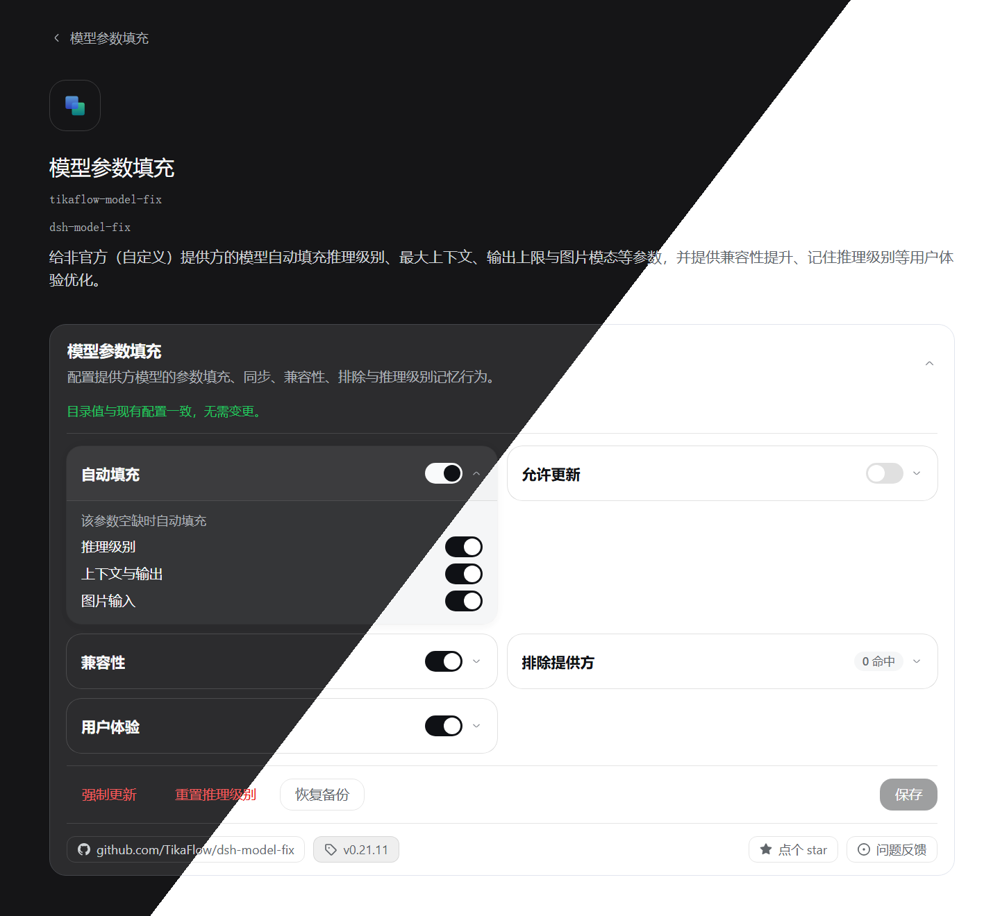

# dsh-model-fix

> 本插件已被 [awesome-dsh-plugin](https://github.com/awesome-dsh-plugin/awesome-dsh-plugin) 收录，同时可在 [dsh-market](https://github.com/dsh-market/dsh-market) 中搜索、安装。

DSH[（DeepSeek Harness）](https://github.com/deepseek-ai/deepseek-harness) 插件：给非官方（自定义）提供方的模型自动填充推理级别（`reasoningEfforts`）、最大上下文（`contextWindow`）、输出上限（`maxTokens`）与图片模态（`input`）等参数，数据来自 [models.dev](https://models.dev)。同时，提供兼容性提升、记住推理级别等用户体验优化。

插件截图：



[更多截图](screenshot/)

## 功能

- 自动填充：模型缺失 `reasoningEfforts` / `contextWindow` / `maxTokens` / `input` 时按 models.dev 数据补全；已有配置不受影响
- 允许更新：当 models.dev 数据更新时，插件会自动更新模型参数（已有配置也会更新）
- 不使用`developer`角色：为所有 `api: openai-completions` 的提供方路由写入 `compat.supportsDeveloperRole: false`（不使用 `developer` 角色）；关闭该开关则移除此字段
- 排除提供方：列出的提供方本插件完全不动（填充、更新、兼容性写入、强制更新、重置推理级别时跳过），基本等效于对它关闭插件
- 记住推理级别：每模型独立记住上次手动选择的推理级别，切换模型时自动恢复
- 清除记忆：关闭「记住推理级别」时，将会询问是否确认清除记忆，可在清除后不保存设置，依然可以继续记忆，但旧记忆已清除
- 默认使用 high：切换模型时，若没有该模型的记忆，且模型提供 `high` 档位，则自动把推理级别设为 `high`
- 强制更新：按 models.dev 当前值立即覆盖一遍
- 恢复备份：回退到插件启动时已存在的模型参数
- 可视化设置：见下文
- 开箱即用：启动即以内置缓存填充（离线可用），数据随后自动保持最新

### 可视化设置

- 入口：
  - 「设置」-->「模型」-->「模型参数填充」卡片
  - 「设置」-->「插件」-->「插件配置」-->「模型参数填充」卡片（DSH < `0.1.6-alpha.2`）
  - 「设置」-->「内置插件」-->「模型填充」选项卡-->「模型参数填充」卡片（此处卡片默认展开）
  - 「插件」-->「已安装」-->「模型参数填充」详情页（DSH >= `0.1.6-alpha.2`；此处卡片默认展开）
  - 「插件」-->「已安装」-->「模型参数填充」详情页-->「包含的组件」-->「dsh-model-fix」

## 安装

> 以下所有安装方式安装的内容、效果完全相同。

### 方式一：通过插件管理页面安装（推荐）

在 DSH 中，点击「插件」-->「添加插件」，复制以下链接到输入框，完成安装：

```
https://github.com/TikaFlow/dsh-model-fix/releases/latest/download/dsh-model-fix.tgz
```

### 方式二：通过插件市场安装（推荐）

> 使用 `dsh-market` 插件市场安装时无需重启 DSH 即生效。

直接在插件市场搜索我的用户名：`TikaFlow`，找到「dsh-model-fix」插件，即可安装。

### 方式三：通过 Release 预构建包安装

```bash
dsh plugin --profile web add https://github.com/TikaFlow/dsh-model-fix/releases/latest/download/dsh-model-fix.tgz
```

### 方式四：通过 Git 安装（不推荐）

> 使用这种方式安装需要现场编译插件，不推荐。

```bash
dsh plugin --profile web add github:TikaFlow/dsh-model-fix
```

## 版本说明

由于 DSH 正在快速迭代，因此本插件所依赖/兼容的 DSH 宿主版本总是追随较新的版本。若插件功能异常，请检查 DSH 版本是否满足插件依赖版本。

### 支持范围

DSH `0.1.7-rc.2` ~ `0.2.0-rc.2`

## 使用说明

无需任何操作，进入 DSH 后插件即自动生效：自动填充缺失的模型参数，并记住用户手动选择的推理级别。某个提供方不想被接管，就把它的 id 加进「排除提供方」（见下文）。

### 配置

**图形界面（推荐）**：见 [可视化设置](#可视化设置)

**手动编辑**（等效方式）：Web 设置界面右上角「打开配置文件 / Open configuration file」直接编辑 `settings.yaml`：

```yaml
tikaflow-model-fix:
  version-6:
    autoFill:           # 自动填充缺失的字段；默认 true
      reasoning: true
      context: true
      image: true
    allowUpdate:        # 允许更新已有模型的字段；默认 false
      reasoning: false
      context: false
      image: false
    compat:             # 兼容性写入
      disableDeveloper: true
    excludes: []        # 排除的提供方 id 列表；默认空
    efforts: {}         # 每模型推理级别记忆（运行时自动维护，无需手动编辑）
    userExperience:     # 用户体验（前端行为开关），对所有提供方生效，不支持排除
      rememberEfforts: true
      defaultHigh: false
```

注意 `compat` 与其余开关不同：**开启即写入、关闭即移除**。关闭期间该字段由你自己管理。

### 排除提供方（`excludes`）

- 在「排除提供方」里输入 id 并回车添加，点「保存」后生效；id 规则与宿主新建提供方一致：小写字母开头，之后可用小写字母、数字和短横线。
- **推荐顺序：先加排除、再新建提供方**——新建会立即触发一次填充，需要先加才来得及。
- 排除只对保存之后的行为生效：此前已填充的参数不会自动撤销，需要的话请自行清理。
- 条目样式：绿点 + 绿色胶囊＝该提供方已存在，保存后排除将会生效；灰色＝暂无同名提供方（不是写错，创建后即生效）。
- 列表按录入顺序保存；输入已存在的 id 会提示并不添加；每条右侧的删除按钮可移除。
- 想让某个已有提供方从此不再被接管，同样把它加进排除列表。
- 「排除提供方」不影响「用户体验」组的开关：记住推理级别、默认使用 high 对所有提供方一律生效。
